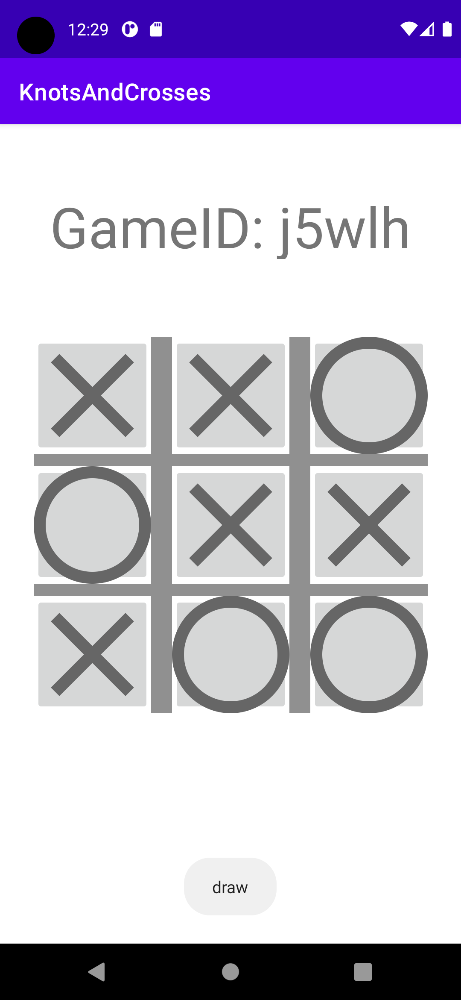

# Introduksjon

Denner readme filen skal fungere som rapport for Prosjektoppgave 2 i ikt205. Den skal ha et avsnitt som sier litt om appen, og ha et par skjembilder fra den. Målet med oppgaven er å utvikle en app so samhandler med anvist spillserver for spillet tic tac toe. Spesifikasjonene for web tjenesten ble gitt av vedlagt yaml.fil, og analysen av denne er gjort ved hjelp av verktøy fra https://editor.swagger.io/. Denne rapporten tar først for seg litt av utviklingsprosessen, og ser så på det endelige resultatet. Skjermbilder er fordelt gjennom rapporten der det er hensiktsmessig, men i hovedsak beskriver de bruk av den fullførte appen.

# Utviklingsprosessn

Arbeidet startet med utvikling avv et kommunikasjonslag i appen. Dett er implementert gjennom en klasse som gjør all komunikkasjon med spillserveren, og fordeler uthenta data til fornuftige klasser. Jeg valgte å bruke Livedata klassen til å lagre statusen til spillet slik at den senere kunne observeres av en gitt aktivitet. Forskjellige måter å implementere http requests ble forsøkt, men å konvertere json til string ved hjelp av gson, for så å gjøre spørringer ved hjelp av string request fra volley biblioteket. Main activity hvor applikasjonen starter er kun brukt til å hente spillerens navn, og gir menyvalg for enten å starte et nytt spill, eller bli med i et allerede startet spill.

## Gameplay

Selve spillingen er skilt ut til en egent aktivitet som oobserverer alle endringer i gameplay livedata fra communikasjons objektet. Funksjonene i main er derfor fokusert på å instruere kominkasjonslaget om hvilke endringer som skal gjøres og lastes opp i gameplay objektet. Det er også en funksjon som sjekker hvorvidt en av spillerne har oppnådd en seierstilstand mellom hvert trekk.

# Appen i bruk
Første serien med bilder viser oppstarten av et nytt spill. Dersom brukeren starter et nytt spill, får de tildelt verdien X, om de blir med i noen andres spille får de verdien O. Dersom man blir med må man også vente på at første trekk skal spilles før man får gjøre turen sin

  
   
  

Spillet fortsetter sekvensielt og veksler mellom de to spillerne. Bildeserien under viser gjennomspilling av et fulstendig spill. 

  
   
  
  
  

Videre vises dokumentasjon av noen andre mulige seierstilstander

  
   
   
  

# Konlusjon

Helhetlig har prosjektet vært en utfordrende og lærerik opplevelse. Bruken av requests til å kontakte en nett-tjeneste fremstår som svært grunnleggende og nyttig kunskap å ha. Videre har implementasjon av komnuikasjonslag og generell utvikler struktur også vært svært nyttig. Selv om det selvfølgelig alltid finnes forbedringer som kan gjøres.
